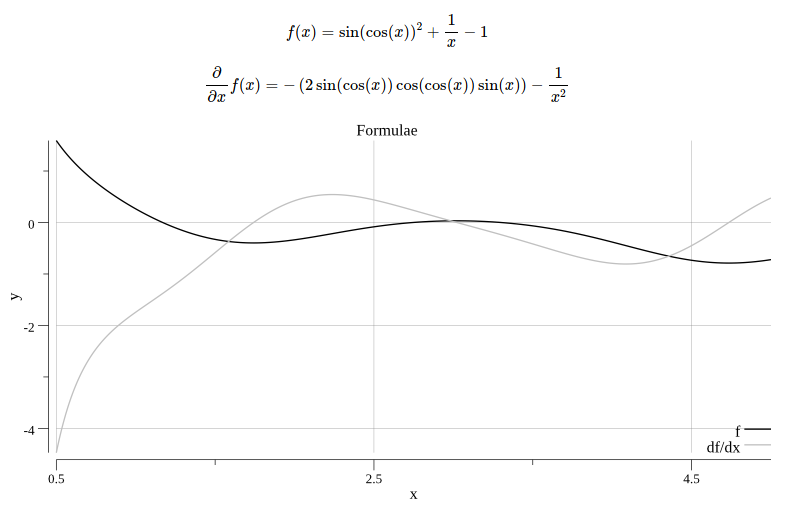

# Formulae <a name="formulae"></a> [](https://travis-ci.org/tdewolff/formulae) [](http://godoc.org/github.com/tdewolff/formulae)

Formulae is a formula parser and calculator and can optimize and derive (to `x`) formulae.

### From
`sin(cos(x))^2+1/x-1`

### To


## Installation
Run the following command

	go get github.com/tdewolff/formulae

or add the following import and run the project with `go get`
``` go
import (
	"github.com/tdewolff/formulae"
)
```

## Usage
### Parse
Parse a formula from string and return a `Function`.
``` go
f := formulae.Parse("sin(cos(x))^2+1/x-1")
```

### Calculate
Calculate the function for a single `x` value.
``` go
y, err := f.Calc(5+0i) // -0.722...
if err != nil {
    panic(err)
}
```

### Interval
Calculate the function between the interval `a` and `b`, with step-size `step`.
``` go
ys, errs := f.Interval(a, step, b)
if len(errs) != 0 {
    panic("errors")
}
```

### Optimize
Optimize the function by elimination and simplification.
``` go
f.Optimize()
```

### Derive to `x`
Obtain the derivative of `f` to `x`.
``` go
df := f.Derivative()
```

### LaTeX notation
Export as LaTeX notation
``` go
s := f.LaTeX() // $$f(x) = \sin(\cos(x))^{2}+\frac{1}{x}-1$$
```

## Example
Basic example that plots to image.
``` go
package main

import (
	"fmt"
	"image/color"
	"log"
	"os"

	"github.com/tdewolff/formulae"
	"gonum.org/v1/plot"
	"gonum.org/v1/plot/plotter"
	"gonum.org/v1/plot/vg"
)

func main() {
	// Parse formula
	in := "sin(cos(x))^2+1/x-1"
	f, errs := formulae.Parse(in)
	if len(errs) > 0 {
		log.Fatal(errs)
	}
	df := f.Derivative()

	// Calculate function
	xs, ys, errs := f.Interval(0.5, 0.01, 5.0)
	if len(errs) > 0 {
		log.Fatal(errs)
	}
	xys := make(plotter.XYs, len(xs))
	for i := range xs {
		xys[i].X = xs[i]
		xys[i].Y = real(ys[i])
	}
	_, _, ymin, _ := plotter.XYRange(xys)
	if ymin > 0 {
		ymin = 0
	}

	// Calculate function derivative
	xs2, ys2, errs := df.Interval(0.5, 0.01, 5.0)
	if len(errs) > 0 {
		log.Fatal(errs)
	}
	xys2 := make(plotter.XYs, len(xs2))
	for i := range xs2 {
		xys2[i].X = xs2[i]
		xys2[i].Y = real(ys2[i])
	}

	// Plot functions
	p, err := plot.New()
	if err != nil {
		log.Fatal(err)
	}

	p.Title.Text = "Formula"
	p.X.Label.Text = "x"
	p.Y.Label.Text = "y"
	p.Y.Min = ymin

	line, err := plotter.NewLine(xys)
	if err != nil {
		log.Fatal(err)
	}
	line2, err := plotter.NewLine(xys2)
	if err != nil {
		log.Fatal(err)
	}
	line2.LineStyle.Color = color.Gray{192}

	p.Add(plotter.NewGrid())
	p.Add(line)
	p.Add(line2)
	p.Legend.Add("f", line)
	p.Legend.Add("df/dx", line2)

	if err := p.Save(8*vg.Inch, 4*vg.Inch, "formula.png"); err != nil {
		log.Fatal(err)
	}
}
```

## License
Released under the [MIT license](LICENSE.md).

[1]: http://golang.org/ "Go Language"
